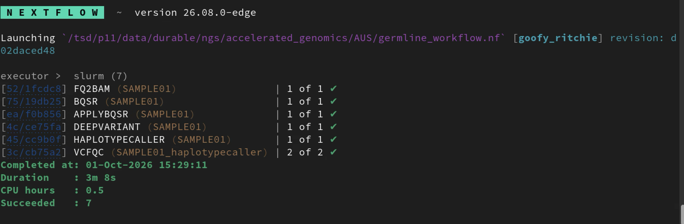
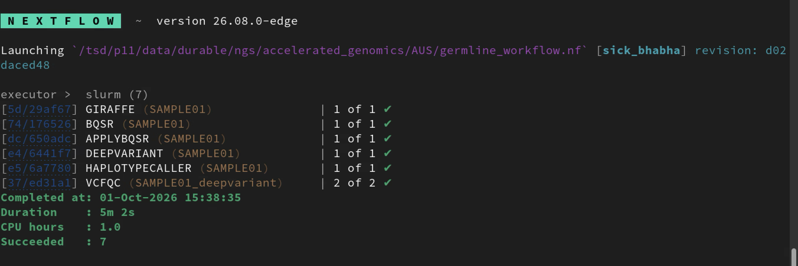
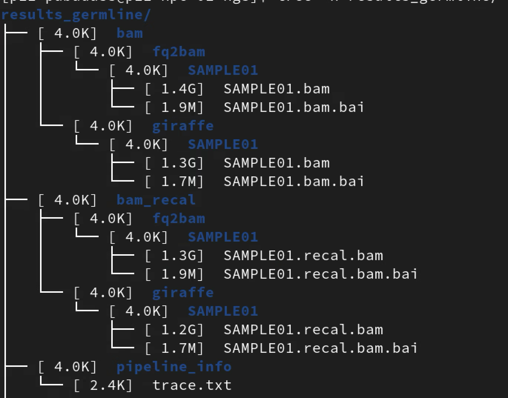
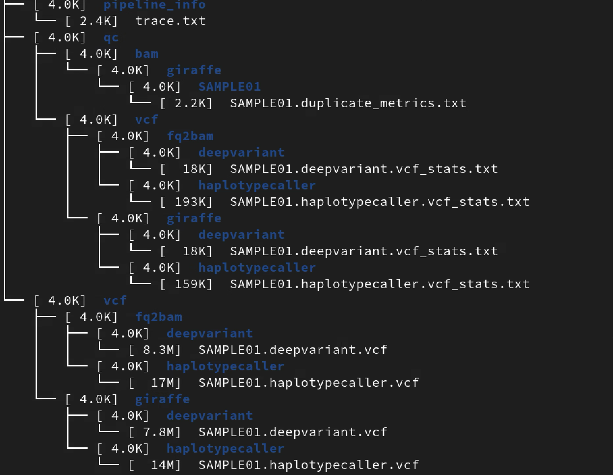
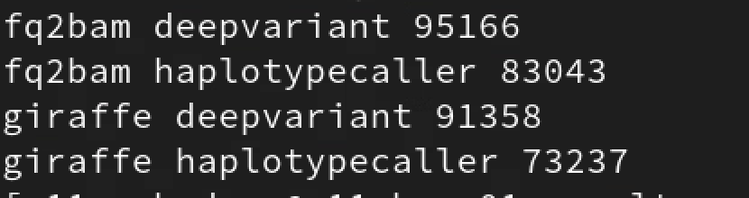
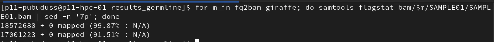
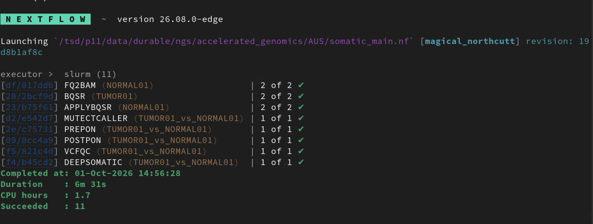
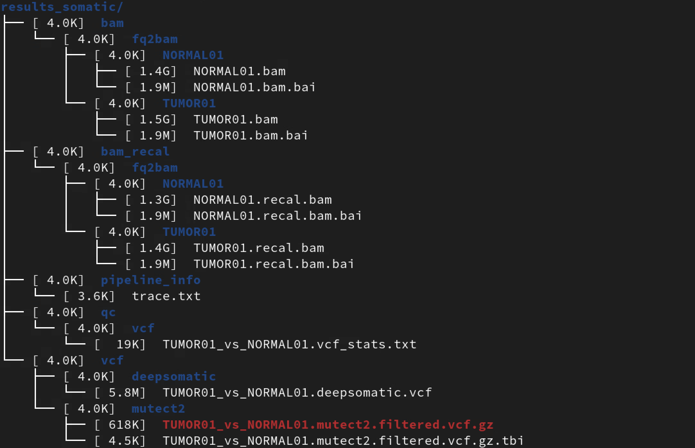

# TSD end-to-end Smoke-test: Germline pipeline

## End-to-end Smoke-testing of Germline pipeline (Giraffe + FQ2BAM) on TSD

### FQ2BAM - Germline run

### Giraffe - Germline run

### Results files

## Comparison

### Variant count comparison

### Percentage of reads mapped

## Somatic pipeline

- Somatic pipeline behavior didn't change, verify the somatic run

