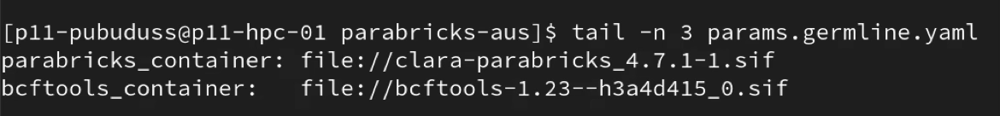
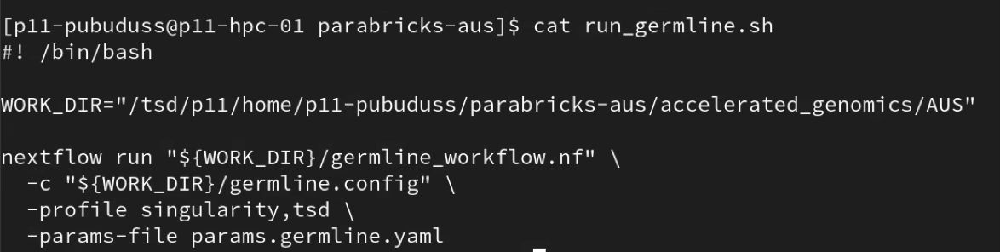
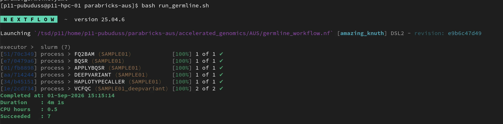
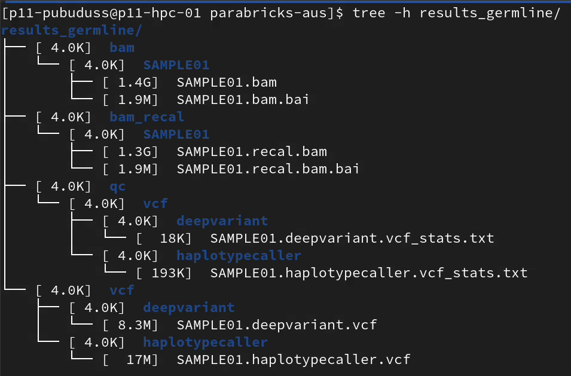
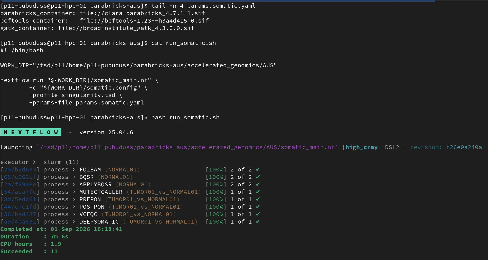
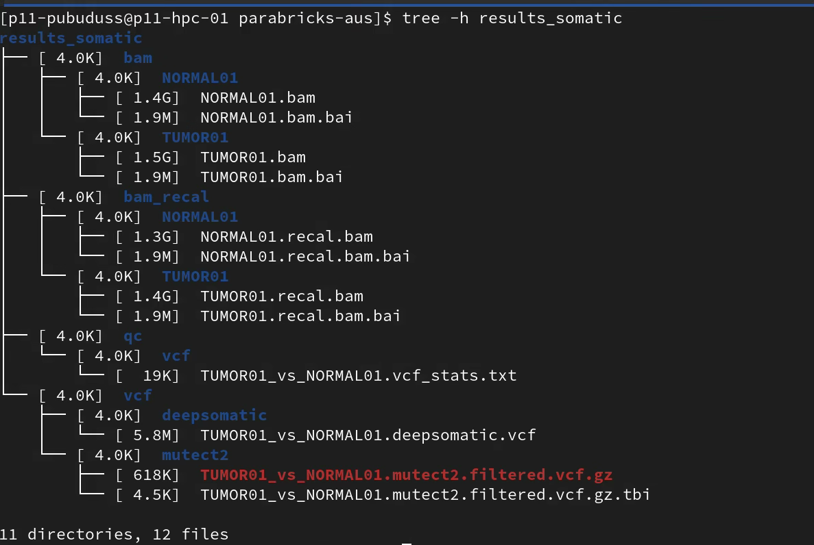

# Germline & Somatic Pipeline Testing Checklist

**GitHub Issue:** [issues-54](https://github.com/NAICNO/accelerated_genomics/issues/54)
**Environment / profile used:** TSD
**Pipeline commit/version:** Commit - 11474b4

---

## 1. Document Sources

- [x] Input data source(s): Same datasets used in [issues-30](https://github.com/NAICNO/accelerated_genomics/issues/30)
- [x] Reference genome / index version: Same reference used in [issues-30](https://github.com/NAICNO/accelerated_genomics/issues/30)
- [ ] Any reference truth sets used for validation (e.g. GIAB) recorded - NA
- [x] Config file(s) used linked: `configs/PARABRICKS_TSD.conf`
- [x] Parabricks / CUDA / container version recorded
- [x] Hardware used recorded (node, GPU type/count)

**Versions/Paths:**
- Parabricks container version - v4.7.1-1
- Container path: /tsd/p11/p11-pubuduss/parabricks-aus[clara-parabricks_4.7.1-1.sif|broadinstitute_gatk_4.3.0.0.sif|bcftools-1.23--h3a4d415_0.sif]

- Currently Loaded Modules:
  1) Java/25.36
  2) NextFlow/25.04.6

**Hardware specification: Process FQ2BAM**

- gpu-1 node in Colossus

```bash
JobId=397061 JobName=nf-FQ2BAM_ (SAMPLE01)
UserId=p11-pubuduss (2506) GroupId=p11-pubuduss-group(3697) MCS_label=p11
Priority=19760 Nice=0 Account=p11 Q0S=p11
JobState=RUNNING Reason=None Dependency=(null)
Requeue=0 Restarts=0 BatchFlag=1 Reboot=0 ExitCode=0:0
RunTime=00:00:18 TimeLimit=00:20:00 TimeMin=N/A
SubmitTime=2026-09-02T06:43:20 EligibleTime=2026-09-02T06:43:20
AccrueTime=2026-09-02T06:43:22
StartTime=2026-09-02T06:43:22 EndTime=2026-09-02T07:03:22 Deadline=N/A
PreemptEligibleTime=2026-09-02T06:43:22 PreemptTime=None
SuspendTime=None SecsPreSuspend=0 LastSchedEval=2026-09-02T06:43:22 Scheduler=Main
Partition=accel AllocNode:Sid=p11-hpc-01:161839
ReqNodeList=(null) ExcNodeList=(null)
NodeList=gpu-1
BatchHost=gpu-1
NumNodes=1 NumCPUs=16 NumTasks=1 CPUs/Task=16 ReqB:S:C:T=0:0:*:*
ReqTRES=cpu=16, mem=125G, node=1, gres/gpu=1
AllocTRES=cpu=16, mem=125G, node=1, gres/gpu=1
Socks/Node=* NtasksPerN:B:S:C=0:0:*:* CoreSpec=*
MinCPUsNode=16 MinMemoryCPU=8000M MinTmpDiskNode=0
MinCPUsNode=16 MinMemoryCPU=8000M MinTmpDiskNode=0
Features= (null) DelayBoot=00:00:00
OverSubscribe=0K Contiguous=0 Licenses= (null) LicensesAlloc= (null) Network= (null)
Command=, command run
WorkDir=/ess/p11/home/p11-pubuduss/parabricks-aus/w0rk/e2/24345bf3dbef2c6dff36e550938118
StdErr=/ess/p11/home/p11-pubuduss/parabricks-aus/work/e2/24345bf3dbef2c6dff36e550938118/.command.log
StdIn=/dev/null
stdout=/ess/p11/home/p11-pubuduss/parabricks-aus/work/e2/24345bf3dbef2c6dff36e550938118/.command. log
TresPerNode=gres/gpu:1
TresPerTask=cpu=16
```

---

## 2. Germline Pipeline

### Run (Germline Pipeline)

- [x] Exact run command recorded (copy-pasteable)
- [x] `-profile` used noted
- [x] Run started: (check screenshots below)
- [x] Run completed and wall-clock duration: (check screenshots below)
- [x] Exit status confirmed (0 / success)
- [x] If `-resume` used: confirmed which tasks actually re-executed vs. were cached (see known resume-cache gotcha — cached ≠ correctly skipped)

**Containers used:**



**Run command:**



**NextFlow run:**



**Results:**



### Results Examination (Germline Pipeline)

- [x] Output directory structure matches expected layout
- [x] HaplotypeCaller output file extensions correct (plain `.vcf`, **not** `.vcf.gz` — known Parabricks constraint)
- [x] VCF opens/validates (e.g. `bcftools stats` or similar)
- [x] Variant counts look reasonable (not empty, not wildly off)
- [x] Coverage/QC metrics reviewed
- [ ] Compared against truth set, if available - NA
- [x] Log files captured/attached as evidence

---

## 3. Somatic Pipeline

### Run (Somatic Pipeline)

- [x] Exact run command recorded (copy-pasteable)
- [x] `-profile` used noted
- [x] Run started: (check screenshots below)
- [x] Run completed and wall-clock duration: (check screenshots below)
- [x] Exit status confirmed (0 / success)
- [x] If `-resume` used: confirmed which tasks actually re-executed vs. were cached
- [ ] Tumor-only vs tumor-normal mode noted

### Results Examination (Somatic Pipeline)

- [x] Output directory structure matches expected layout
- [x] MuTect2/MutectCaller output files present and correctly named (watch for NO_FILE staging collisions — known gotcha, verify unique placeholder names if optional inputs used)
- [x] VCF opens/validates
- [x] Variant counts look reasonable
- [x] Coverage/QC metrics reviewed
- [ ] Compared against truth set, if available
- [x] Log files captured/attached as evidence

**Containers used/ Run command/ NextFlow run:**



**Results:**



---

## Archive

- Results and logs archived in `/tsd/p11/data/durable/aus_beyond_dragen/`