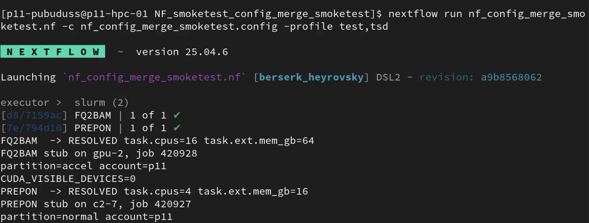
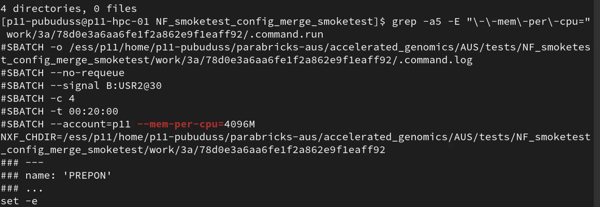
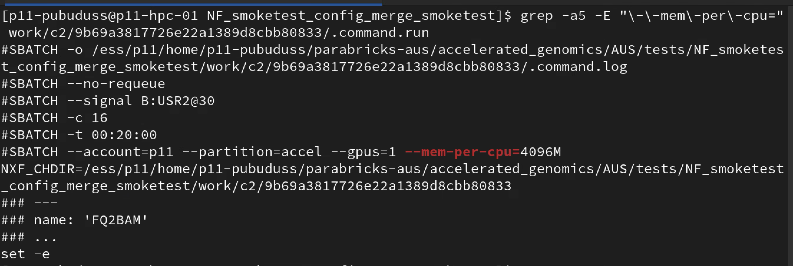

# Smoke test - config-merge behavior

#65 split each cluster file into cluster-specific and resource-sizing profiles.

**#65 profile split:**
```none
.
├── PARABRICKS_FOX.conf         # FOX identity profile
├── PARABRICKS_TSD.conf         # TSD identity profile
├── resources_production.conf   # Resource-sizing for production setting
├── resources_test.conf         # Resource-sizing for testing
└── singularity.conf            # Singularity container specific
```

## Smoke test

Test if cluster identity and per-process sizing actually merge the way the split assumes, once combined via `-profile`, and that omitting the resource profile really fails the run.


### Test: Fox + test sizing

```bash
nextflow run nf_config_merge_smoketest.nf -c nf_config_merge_smoketest.config \
  -profile fox,test
```

**Terminal output:**

```bash
Launching `nf_config_merge_smoketest.nf` [peaceful_brown] revision: 6cba5fe629

executor >  slurm (2)
[4a/5d8c04] FQ2BAM [100%] 1 of 1 ✔
[0a/9af660] PREPON [100%] 1 of 1 ✔
PREPON  -> PREPON stub on c1-12.fox, job 4119791
partition=normal account=ec232
FQ2BAM  -> FQ2BAM stub on gpu-13.fox, job 4119790
partition=accel account=ec232
CUDA_VISIBLE_DEVICES=0
```

**TRACE file:**

```none
$ cat trace_nf_config_merge_smoketest.txt
task_id	hash	native_id	name	status	exit	submit	duration	realtime	%cpu	peak_rss	peak_vmem	rchar	wchar
2	4a/5d8c04	4119790	FQ2BAM	COMPLETED	0	2026-09-03 14:06:19.745	4.6s	9ms	125.2%	0	0	171 KB	399 B
1	0a/9af660	4119791	PREPON	COMPLETED	0	2026-09-03 14:06:19.778	4.6s	6ms	154.2%	0	0	166.8 KB	373 B
```

**Work-directories:**

```none
$ tree -a work/
work/
├── 0a
│   └── 9af660a3d1fedac2831c92027e0d84
│       ├── .command.begin
│       ├── .command.err
│       ├── .command.log
│       ├── .command.out
│       ├── .command.run
│       ├── .command.sh
│       ├── .command.trace
│       └── .exitcode
└── 4a
    └── 5d8c04857e8714398e987e3c7cfe25
        ├── .command.begin
        ├── .command.err
        ├── .command.log
        ├── .command.out
        ├── .command.run
        ├── .command.sh
        ├── .command.trace
        └── .exitcode
```

**SLURM Resource request - `.command.run`:**

```none
$ grep -a1 -E "gpus=1|name:|\-\-account|#SBATCH \-c|#SBATCH \-t" work/*/*/.command.run

work/0a/9af660a3d1fedac2831c92027e0d84/.command.run-#SBATCH --signal B:USR2@30
work/0a/9af660a3d1fedac2831c92027e0d84/.command.run:#SBATCH -c 4
work/0a/9af660a3d1fedac2831c92027e0d84/.command.run:#SBATCH -t 00:20:00
work/0a/9af660a3d1fedac2831c92027e0d84/.command.run-#SBATCH --mem 16384M
work/0a/9af660a3d1fedac2831c92027e0d84/.command.run-#SBATCH -p normal
work/0a/9af660a3d1fedac2831c92027e0d84/.command.run:#SBATCH --account=ec232
work/0a/9af660a3d1fedac2831c92027e0d84/.command.run-### ---
work/0a/9af660a3d1fedac2831c92027e0d84/.command.run:### name: 'PREPON'
work/0a/9af660a3d1fedac2831c92027e0d84/.command.run-### ...
--
work/4a/5d8c04857e8714398e987e3c7cfe25/.command.run-#SBATCH --signal B:USR2@30
work/4a/5d8c04857e8714398e987e3c7cfe25/.command.run:#SBATCH -c 16
work/4a/5d8c04857e8714398e987e3c7cfe25/.command.run:#SBATCH -t 00:20:00
work/4a/5d8c04857e8714398e987e3c7cfe25/.command.run-#SBATCH --mem 65536M
work/4a/5d8c04857e8714398e987e3c7cfe25/.command.run-#SBATCH -p accel
work/4a/5d8c04857e8714398e987e3c7cfe25/.command.run:#SBATCH --account=ec232 --gpus=1
work/4a/5d8c04857e8714398e987e3c7cfe25/.command.run-### ---
work/4a/5d8c04857e8714398e987e3c7cfe25/.command.run:### name: 'FQ2BAM'
work/4a/5d8c04857e8714398e987e3c7cfe25/.command.run-### ...
```

- `FQ2BAM` run file has `--gpus=1` flag ✅ 
- `-t`, `--mem` and `-c` (time, memory, CPUs) flags are in .command.run as expected and match "test" profile  ✅ 
- Points to correct account `--account=` ✅ 

### Fail-fast check

**Run command with `-profile fox`**

```none
$ nextflow run nf_config_merge_smoketest.nf -c nf_config_merge_smoketest.config   -profile fox
Nextflow 26.04.6 is available - Please consider updating your version to it

 N E X T F L O W   ~  version 26.04.3

Launching `nf_config_merge_smoketest.nf` [stupefied_boltzmann] revision: 6cba5fe629

WARN: Access to undefined parameter `_resource_profile` -- Initialise it to a default value eg. `params._resource_profile = some_value`
No resource-sizing profile selected. Add `production` or `test` to -profile alongside `tsd`/`fox`, e.g. -profile tsd,test
```

- Failed with correct error message as expected  ✅ 

### Test: TSD + test sizing



**`.command.run` - PREPON:**



- `-c 4`, no GPU flags, no `--partition=accel`
- `--mem-per-cpu=4096M` × 4 cpus = 16384M = **16GB total**
- Match "PREPON's" `ext = [ mem_gb: 16 ]` entry in `resources_test.conf`. 
- No plain `--mem` in `.command.run`

**`.command.run` - FQ2BAM:**



- `-c 16`
- `--partition=accel --gpus=1`
- "`--mem-per-cpu`=4096M × 16 cpus" = 65536M = 64GB total
- Match FQ2BAM's `ext = [ mem_gb: 64 ]` entry
- No conflicting `--mem`