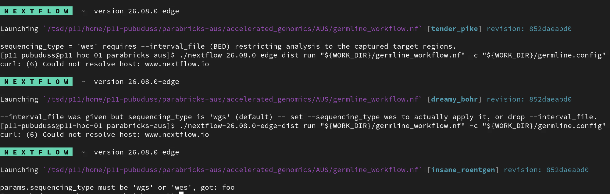
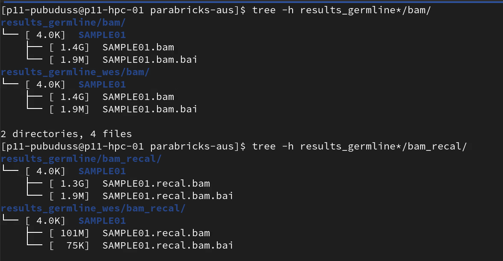
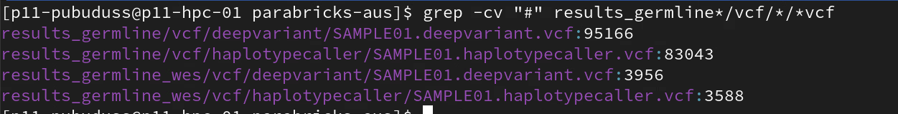
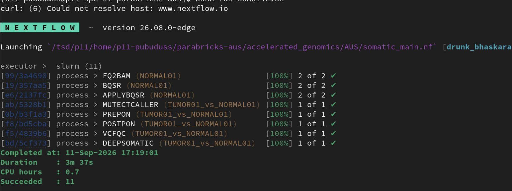
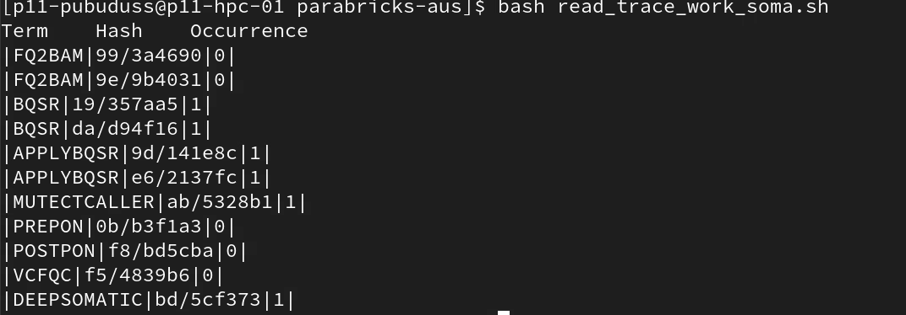
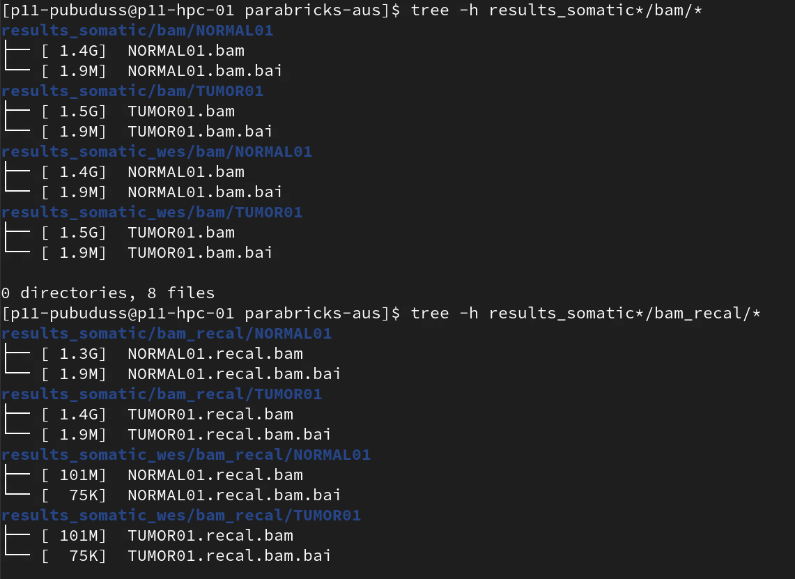
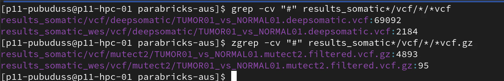

# WES Germline & Somatic End-to-End Smoke Test

## Run metadata

| Field | Value |
|-------|-------|
| Date tested | |
| Tested by | |
| Cluster(s) | ☐ Fox  ☐ TSD |
| Pipeline commit/revision | |
| Parabricks container | `clara-parabricks_4.7.1-1.sif`  |
| `nextflow` version | 26.08.0-edge |
| `-profile` used | `singularity,fox,test` & `singularity,tsd,test` |
| Source data | [GitHub: issue#](https://github.com/NAICNO/accelerated_genomics/issues/88) |
| `interval_file` used | (e.g. `GRCh38_chr21_intervals.bed` — record path + how it was derived) |
| Parameters | [params.germline_wes.yaml](AUS/DOCs/issues/issues_88/params.germline_wes.yaml);[params.somatic_wes.](AUS/DOCs/issues/issues_88/params.somatic_wes.yaml) |

## Goal

Confirm WES support on real cluster infrastructure

1. `--interval-file` reaches `bqsr`, `applybqsr`, `haplotypecaller`, `mutectcaller`,
   `deepvariant`, `deepsomatic` — and reaches none of `fq2bam`.
2. `--use-wes-model` is auto-derived correctly for both `deepvariant` and `deepsomatic` when
   `sequencing_type=wes` and the tool's own `*_mode` is `shortread` (default) — and correctly
   *absent* when `*_mode` is `pacbio`/`ont`.
3. `--mode ${params.*_mode}` is passed unconditionally and symmetrically by both callers.
4. Fail-fast validation actually fires on a real invocation, not just in the local smoke test.
5. Restriction is real, not just smaller-looking: no variant calls land outside the target
   BED.
6. The params file used matches the current `params.*.yaml.example` — no stale/removed keys
   left over from a prior design (e.g. the removed `deepsomatic_model_type`).

## Prerequisites

- [x] Exome (target-region) BED file available and path recorded above
- [x] `params.germline_wes.yaml` / `params.somatic_wes.yaml`
- [x] A comparable WGS run's outputs available for the same sample(s), for the size/count
      comparison (e.g. `results_germline_4.7.1/`, `results_somatic_v4.7.1/`)
- [x] SLURM/GPU allocation available on the target cluster(s)

---

## 1. Germline pipeline

### 1a. Run

- [x] Exact run command recorded (copy-pasteable)
- [x] `-profile` recorded
- [x] Run started / completed timestamps, wall-clock duration, CPU hours
- [x] Exit status confirmed (0 / success, all tasks ✔)

***FOX:***
**Run command:**

```bash
#! /bin/bash

WORK_DIR="/projects/ec232/ngs/analysis/AUS/accelerated_genomics/AUS"

## WES
./nextflow-26.08.0-edge-dist run "${WORK_DIR}/germline_workflow.nf" \
  -c "${WORK_DIR}/germline.config" \
  -profile singularity,fox,test \
  -params-file params.germline_wes.yaml
```

**Terminal output:**

```none
 N E X T F L O W   ~  version 26.08.0-edge

Launching `/projects/ec232/ngs/analysis/AUS/accelerated_genomics/AUS/germline_workflow.nf` [elegant_stallman] revision: 852daeabd0

executor >  slurm (7)
[ab/2c1f22] FQ2BAM (SAMPLE01)                [100%] 1 of 1 ✔
[cf/1390fb] BQSR (SAMPLE01)                  [100%] 1 of 1 ✔
[1f/66ed6f] APPLYBQSR (SAMPLE01)             [100%] 1 of 1 ✔
[55/00a2ca] DEEPVARIANT (SAMPLE01)           [100%] 1 of 1 ✔
[92/a33f58] HAPLOTYPECALLER (SAMPLE01)       [100%] 1 of 1 ✔
[d2/33b06a] VCFQC (SAMPLE01_haplotypecaller) [100%] 2 of 2 ✔
Completed at: 11-Sep-2026 15:04:38
Duration    : 3m 26s
CPU hours   : 0.6
Succeeded   : 7
```

***TSD:***


### 1b. Fail-fast validation (real-cluster spot check)

Run each of these as a deliberate one-off (expect immediate failure, before any process is
scheduled — confirm no SLURM job is submitted):

- [x] `--sequencing_type wes` with no `--interval_file` → errors
- [x] `--interval_file <path>` with `--sequencing_type wgs` (default) → errors
- [x] Invalid `--sequencing_type` value → errors

```bash
# `--sequencing_type wes` with no `--interval_file`
# commenting out interval_file: GRCh38_chr21_intervals.bed

./nextflow-26.08.0-edge-dist run "${WORK_DIR}/germline_workflow.nf"   -c "${WORK_DIR}/germline.config"   -profile singularity,fox,test   -params-file params_fail.yaml

# `--interval_file <path>` with `--sequencing_type wgs`
# commenting out sequencing_type: wes

./nextflow-26.08.0-edge-dist run "${WORK_DIR}/germline_workflow.nf"   -c "${WORK_DIR}/germline.config"   -profile singularity,fox,test   -params-file params_fail.yaml
```

**Terminal output:**

**FOX:**

```none
> Missing required params: sample_id, fastq_1, fastq_2, ref, known_sites, parabricks_container, bcftools_container

> sequencing_type = 'wes' requires --interval_file (BED) restricting analysis to the captured target regions.

> params.sequencing_type must be 'wgs' or 'wes', got: foo
```

***TSD:***



### 1c. Direct command-line evidence (not just output-size inference)

Pull the actual resolved `pbrun` command line for each task from `.command.sh` in the task's
work directory (path is in the Nextflow log, e.g. `[a5/3e9489]` → `work/a5/3e9489*/.command.sh`),
or from `results/pipeline_info/trace.txt` if it captures the full command.

- [ ] `FQ2BAM` — confirm **no** `--interval-file` present
- [ ] `BQSR` — confirm `--interval-file <path>` present
- [ ] `APPLYBQSR` — confirm `--interval-file <path>` present
- [ ] `HAPLOTYPECALLER` — confirm `--interval-file <path>` present
- [ ] `DEEPVARIANT` — confirm `--interval-file <path>`, `--mode shortread`, and
      `--use-wes-model` all present

```bash
# read_trace_work.sh

#!/usr/bin/env bash

# Define the list of PBCMD values to search for
pbcmd_list=("FQ2BAM" "BQSR" "APPLYBQSR" "DEEPVARIANT" "HAPLOTYPECALLER" "VCFQC")

trace_file="results_germline_wes/pipeline_info/trace.txt"

# Print TSV header
printf "Term\tHash\tOccurrence\n"

for pbcmd in "${pbcmd_list[@]}"; do
    # Read unique matching hashes into an array
    mapfile -t hashes < <(grep -E "\s$pbcmd\s" "$trace_file" | cut -f 2 | sort -u)

    # If no hashes found, record 0 occurrences
    if [[ ${#hashes[@]} -eq 0 || -z "${hashes[0]}" ]]; then
        printf "%s\t%s\t%s\n" "$pbcmd" "NA" "0"
        continue
    fi

    for hash in "${hashes[@]}"; do
        # Expand matching scripts into an array
        work_script=(work/${hash}*/.command.sh)

        if [[ -f "${work_script[0]}" ]]; then
            # Sum match counts across any expanded script files for this hash
            count=$(grep -c "interval-file" "${work_script[@]}" | awk -F: '{s+=$NF} END {print s+0}')
        else
            count=0
        fi

        printf "%s\t%s\t%s\n" "$pbcmd" "$hash" "$count"
    done
done
```

*Output in FOX:*

|Term| Hash | Occurrence |
|----|------|------------|
|FQ2BAM|41/ad2094|0|
|BQSR|bd/c14502|1|
|APPLYBQSR|38/cf6855|1|
|DEEPVARIANT|42/dc7e62|1|
|HAPLOTYPECALLER|5b/29eb46|1|
|VCFQC|25/513029|0|
|VCFQC|29/9fbfa1|0|

*Output in TSD:*


### 1d. Negative-mode case (optional but recommended for full symmetry coverage)

- [x] Re-run `DEEPVARIANT` alone (or a minimal re-run) with `--deepvariant_mode pacbio` and
      confirm the resolved command shows `--mode pacbio` and **no** `--use-wes-model`

```bash
# YAML entries
# ---- optional ----
deepvariant_mode: pacbio   # shortread | ont | pacbio (pbrun v4.3.1) -- confirm against `pbrun deepvariant --help`
emit_gvcf: false              # set true to have haplotypecaller emit a GVCF instead of a regular VCF

# exome (WES) support -- uncomment both to restrict analysis to target regions;
# interval_file must be BED. See EXOME_PROCESSING_SPECS_DEV.md.
sequencing_type: wes
interval_file: GRCh38_chr21_intervals.bed

```

*Terminal outout:*
```none
[f4/41fd68] DEEPVARIANT (SAMPLE01)           [100%] 1 of 1 ✔

$ cat work/f4/41fd68877b8c5a0d78e925eb640bfa/.command.sh
#!/bin/bash -ue
pbrun deepvariant \
    --ref Homo_sapiens_assembly38.fasta \
    --in-bam SAMPLE01.recal.bam \
    --mode pacbio \
    --out-variants SAMPLE01.deepvariant.vcf \
    --interval-file GRCh38_chr21_intervals.bed \
     \
    --num-gpus 1

```

### 1e. Output comparison vs. WGS baseline

- [x] `bam/` sizes ~equal between WES and WGS run (confirms `fq2bam` unrestricted)
- [x] `bam_recal/` sizes substantially smaller for WES (confirms BQSR/APPLYBQSR restriction)
- [x] Variant counts (`grep -cv "#" *.vcf`) substantially lower for WES, both callers

```none
# tree -h / grep -cv "#" output, WES vs WGS, both callers
```

**FOX:**

```none
$ tree -h results_germline_*/bam/*
results_germline_4.7.1/bam/SAMPLE01
├── [ 1.4G]  SAMPLE01.bam
└── [ 1.9M]  SAMPLE01.bam.bai
results_germline_wes/bam/SAMPLE01
├── [ 1.4G]  SAMPLE01.bam
└── [ 1.9M]  SAMPLE01.bam.bai

$ tree -h results_germline_*/bam_recal/*
results_germline_4.7.1/bam_recal/SAMPLE01
├── [ 1.3G]  SAMPLE01.recal.bam
└── [ 1.9M]  SAMPLE01.recal.bam.bai
results_germline_wes/bam_recal/SAMPLE01
├── [ 101M]  SAMPLE01.recal.bam
└── [  75K]  SAMPLE01.recal.bam.bai

$ grep -cv "#" results_germline_*/vcf/*/*vcf
results_germline_4.7.1/vcf/deepvariant/SAMPLE01.deepvariant.vcf:95166
results_germline_4.7.1/vcf/haplotypecaller/SAMPLE01.haplotypecaller.vcf:83043
results_germline_wes/vcf/deepvariant/SAMPLE01.deepvariant.vcf:3956
results_germline_wes/vcf/haplotypecaller/SAMPLE01.haplotypecaller.vcf:3588
```

**TSD:**




### 1f. Off-target spot-check (the part size/count comparisons don't prove)

- [ ] `bedtools intersect -v` (or equivalent) of each WES output VCF against `interval_file`
      returns **zero** records — i.e. every call is inside the target regions

```bash
bedtools intersect -v -a results_germline_wes/vcf/deepvariant/SAMPLE01.deepvariant.vcf \
  -b <interval_file>.bed | grep -cv "#"
# expect: 0

bedtools intersect -v -a results_germline_wes/vcf/haplotypecaller/SAMPLE01.haplotypecaller.vcf \
  -b <interval_file>.bed | grep -cv "#"
# expect: 0
```

**Output:**

```none
$ bedtools intersect -v -a results_germline_wes/vcf/deepvariant/SAMPLE01.deepvariant.vcf -b GRCh38_chr21_intervals.bed | grep -cv "#"
> 0

$ bedtools intersect -a results_germline_wes/vcf/deepvariant/SAMPLE01.deepvariant.vcf -b GRCh38_chr21_intervals.bed | grep -cv "#"
> 10641

$ bedtools intersect -v -a results_germline_wes/vcf/haplotypecaller/SAMPLE01.haplotypecaller.vcf -b GRCh38_chr21_intervals.bed | grep -cv "#"
> 0

$ bedtools intersect -a results_germline_wes/vcf/haplotypecaller/SAMPLE01.haplotypecaller.vcf -b GRCh38_chr21_intervals.bed | grep -cv "#"
> 9772

```

### 1g. Logs

- [x] Work-dir logs captured (`.command.sh`/`.command.log`/`.exitcode`) for at least the tasks
      checked in 1c, per the `rsync --include='.command*'` pattern used in
      `Pipeline_Testing_Checklist.md`

---

## 2. Somatic pipeline

### 2a. Run

- [x] Exact run command recorded
- [x] `-profile` recorded
- [x] Run started / completed timestamps, wall-clock duration, CPU hours
- [x] Exit status confirmed (0 / success, all tasks ✔)

**Run command:**

```bash
#!bin/bash

WORK_DIR="/projects/ec232/ngs/analysis/AUS/accelerated_genomics/AUS"

## WES
./nextflow-26.08.0-edge-dist run "${WORK_DIR}/somatic_main.nf" \
-c "${WORK_DIR}/somatic.config" \
-profile singularity,fox,test \
-params-file params.somatic_wes.yaml
```

**Terminal output:**

```none
 N E X T F L O W   ~  version 26.08.0-edge

Launching `/projects/ec232/ngs/analysis/AUS/accelerated_genomics/AUS/somatic_main.nf` [magical_hirsch] revision: 35f2d920cb

executor >  slurm (11)
[82/a512ce] FQ2BAM (TUMOR01)                   [100%] 2 of 2 ✔
[52/cfcf47] BQSR (TUMOR01)                     [100%] 2 of 2 ✔
[e4/246003] APPLYBQSR (NORMAL01)               [100%] 2 of 2 ✔
[f8/24cc62] MUTECTCALLER (TUMOR01_vs_NORMAL01) [100%] 1 of 1 ✔
[31/33b1df] PREPON (TUMOR01_vs_NORMAL01)       [100%] 1 of 1 ✔
[59/df99a1] POSTPON (TUMOR01_vs_NORMAL01)      [100%] 1 of 1 ✔
[3e/073617] VCFQC (TUMOR01_vs_NORMAL01)        [100%] 1 of 1 ✔
[f5/940de3] DEEPSOMATIC (TUMOR01_vs_NORMAL01)  [100%] 1 of 1 ✔
Completed at: 11-Sep-2026 17:10:20
Duration    : 6m 31s
CPU hours   : 2.6
Succeeded   : 11
```

**TSD:**



### 2b. Fail-fast validation (real-cluster spot check)

- [x] Same three checks as 1b, run against `somatic_main.nf`

```none
# No --interval_file in params.yaml
> sequencing_type = 'wes' requires --interval_file (BED) restricting analysis to the captured target regions.

# WGS with --interval_file
> --interval_file was given but sequencing_type is 'wgs' (default) -- set --sequencing_type wes to actually apply it, or drop --interval_file.

# Invalid `--sequencing_type`
params.sequencing_type must be 'wgs' or 'wes', got: foo
```

### 2c. Direct command-line evidence

- [x] `FQ2BAM` (tumor + normal) — confirm **no** `--interval-file`
- [x] `BQSR` / `APPLYBQSR` (tumor + normal) — confirm `--interval-file <path>`
- [x] `MUTECTCALLER` — confirm `--interval-file <path>`
- [x] `DEEPSOMATIC` — confirm `--interval-file <path>`, `--mode shortread`, and
      `--use-wes-model` all present

```bash
#!/usr/bin/env bash

# Define the list of PBCMD values to search for
pbcmd_list=("FQ2BAM" "BQSR" "APPLYBQSR" "MUTECTCALLER" "PREPON" "POSTPON" "VCFQC" "DEEPSOMATIC")

trace_file="results_somatic_wes/pipeline_info/trace.txt"

# Print TSV header
printf "Term\tHash\tOccurrence\n"

for pbcmd in "${pbcmd_list[@]}"; do
    # Read unique matching hashes into an array
    mapfile -t hashes < <(grep -E "\s$pbcmd\s" "$trace_file" | cut -f 2 | sort -u)

    # If no hashes found, record 0 occurrences
    if [[ ${#hashes[@]} -eq 0 || -z "${hashes[0]}" ]]; then
        printf "%s\t%s\t%s\n" "$pbcmd" "NA" "0"
        continue
    fi

    for hash in "${hashes[@]}"; do
        # Expand matching scripts into an array
        work_script=(work/${hash}*/.command.sh)

        if [[ -f "${work_script[0]}" ]]; then
            # Sum match counts across any expanded script files for this hash
            count=$(grep -c "interval-file" "${work_script[@]}" | awk -F: '{s+=$NF} END {print s+0}')
        else
            count=0
        fi

        #printf "%s\t%s\t%s\n" "$pbcmd" "$hash" "$count"
        printf "|%s|%s|%s|\n" "$pbcmd" "$hash" "$count"
    done
done
```

**FOX:**

|Term | Hash | Occurrence|
|-----|------|-----------|
|FQ2BAM|4f/a36e49|0|
|FQ2BAM|74/e96659|0|
|BQSR|82/9001f5|1|
|BQSR|cd/a89020|1|
|APPLYBQSR|1b/7f8dc7|1|
|APPLYBQSR|53/3650ed|1|
|MUTECTCALLER|3a/074cf8|1|
|PREPON|9d/53a876|0|
|POSTPON|fa/a96a52|0|
|VCFQC|37/9d07c0|0|
|DEEPSOMATIC|ba/19487f|1|

**TSD:**



### 2d. Negative-mode case

- [ ] Re-run `DEEPSOMATIC` with `--deepsomatic_mode pacbio`, confirm `--mode pacbio` and
      **no** `--use-wes-model`

```bash

```

### 2e. Output comparison vs. WGS baseline

- [x] `bam/` sizes ~equal between WES and WGS (tumor + normal)
- [x] `bam_recal/` sizes substantially smaller for WES (tumor + normal)
- [x] `mutect2` and `deepsomatic` VCF variant counts substantially lower for WES

```none

```

**TSD:**




### 2f. Off-target spot-check

- [ ] `bedtools intersect -v` of `mutect2` filtered VCF against `interval_file` → zero records
- [ ] `bedtools intersect -v` of `deepsomatic` VCF against `interval_file` → zero records

```bash

```

### 2h. Logs

- [x] Work-dir logs captured for at least the tasks checked in 2c

---

## 3. Params-file hygiene

- [ ] `params.germline_wes.yaml` diffed against current `params.germline.yaml.example` —
      no keys present that the example doesn't document
- [ ] `params.somatic_wes.yaml` diffed against current `params.somatic.yaml.example` — no
      keys present that the example doesn't document (specifically: confirm no leftover
      `deepsomatic_model_type` — that param was removed from `somatic.config` on 2026-09-10
      and no longer does anything)

```bash

```

---

## 4. Cross-cluster check (Fox vs. TSD)

- [ ] Both pipelines run with the same `interval_file` / sample(s) on **both** Fox and TSD
- [ ] Runtime and CPU-hours recorded for both, compared
- [ ] No cluster-specific config gotchas re-triggered (stray characters, bare `def`,
      `--mem`/`--mem-per-cpu` conflict)

| Pipeline | Cluster | Duration | CPU hours | Exit status |
|---|---|---|---|---|
| Germline | Fox | | | |
| Germline | TSD | | | |
| Somatic | Fox | | | |
| Somatic | TSD | | | |

---

## 5. Summary

- [ ] Overall pass/fail for full WES coverage (both pipelines, all six checks in section 0's
      Goal list)
- [ ] Any gap found here fed back into `EXOME_OPEN_ITEMS.md` (or closed out there, if this run
      resolves it)

## Sign-off

- [ ] All checks above passed — WES support qualified as fully verified on real cluster data
- Signed off by: ______, date: ______

## Notes / gotchas

- `-resume` can make a run "succeed" without re-executing the tasks you actually changed —
  do a fresh run (or clear the relevant `work/` dirs) when this runbook is being used to
  qualify a code change, not just to re-confirm an already-verified state.
- File-size/variant-count comparisons (1e/2e) are suggestive, not conclusive — section 1c/1f
  and 2c/2f exist specifically because a wrong-but-still-restrictive interval file, or a flag
  that silently failed to apply, can still produce a smaller BAM and fewer variants.
