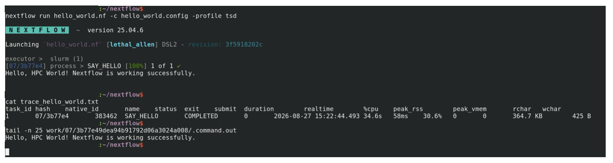
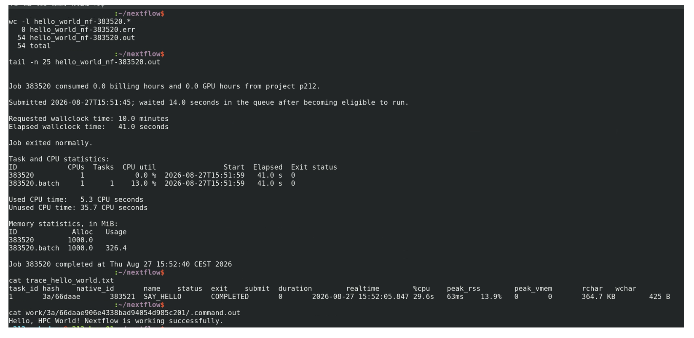

# TSD Smoke test - 01

## TSD - NextFlow deployability smoke test (`hello_world.nf`)

This smoke test verifies that a minimal Nextflow DSL2 workflow can run on TSD via SLURM.

It is intended as a first-pass deployment check before running larger workflows such as `somatic_main.nf` or `germline_workflow.nf`.

## What this test validates

- Nextflow can start successfully on TSD.
- Nextflow can submit a process to the SLURM executor.
- The submitted SLURM task completes successfully.

This test intentionally does **not** validate containers, GPUs, references, or pipeline logic.

## Files

- `hello_world.nf`: minimal workflow with one process (`SAY_HELLO`) that runs `echo`.
- `hello_world.config`: minimal TSD profile (`tsd`) using SLURM.
- `run_hello_world_tsd.sbatch`: SLURM wrapper script to submit the smoke test with `sbatch`.

## Prerequisites

1. Access to TSD/Colossus with SLURM permissions.
2. Update account placeholder `pXX` in:
   - `hello_world.config`
   - `run_hello_world_tsd.sbatch`
3. Nextflow module available on the submit node (`Nextflow/24.04.0` in the sbatch script).

## Run options

### Test 01: submit through sbatch

From this directory:

```bash
sbatch run_hello_world_tsd.sbatch
```

Monitor job:

```bash
squeue -u "$USER"
```

### Test 02: run Nextflow directly from submit node

```bash
nextflow run hello_world.nf -c hello_world.config -profile tsd
```

## Expected result

A successful run prints:

```text
Hello, HPC World! Nextflow is working successfully.
```

You should also see:

- SLURM output/error logs: `hello_world_nf-<jobid>.out` and `hello_world_nf-<jobid>.err`
- Nextflow trace file: `trace_hello_world.txt`
- Output file of NextFlow process (`work/*/*/.command.out`) should print `Hello, HPC World! Nextflow is working successfully.`

### Expected results - Test 01



### Expected results - Test 02



## Troubleshooting scope

If this test fails, the issue is likely in environment plumbing (account, SLURM submission, Nextflow module/setup), not in bioinformatics pipeline logic.
