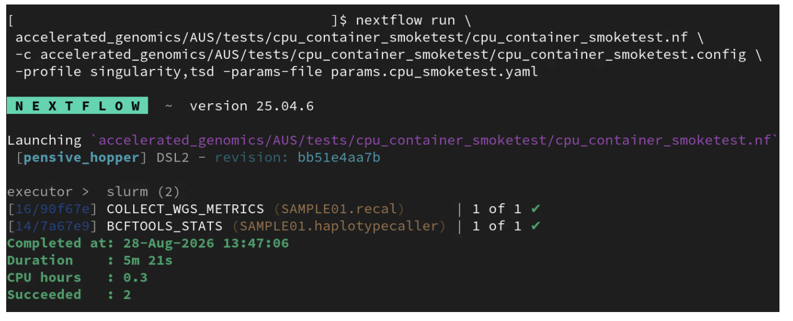
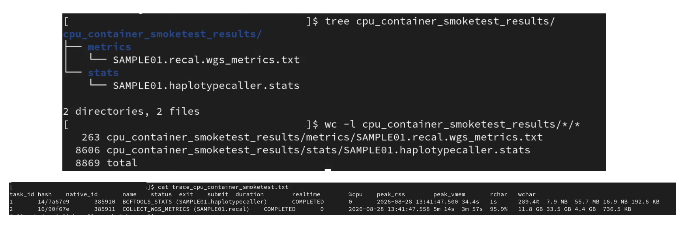

# TSD Smoke test - 02

## CPU processes + Apptainer/Singularity containers (no GPU) `cpu_container_smoketest.nf`

This smoke test verifies that CPU processes and Apptainer/Singularity containers run successfully on TSD via SLURM.

It is intended as the next deployment check after `AUS/tests/TSD_deployability_smoke_test/hello_world.nf`, before running full somatic or germline workflows.

## What this test validates

- Nextflow can execute CPU-only processes through SLURM on TSD.
- Apptainer/Singularity containers can be launched through Nextflow profiles (`singularity,tsd`).
- Real QC tools used by production workflows run successfully inside containers:
  - `gatk CollectWgsMetrics`
  - `bcftools stats`
- Real pipeline-like inputs are readable from TSD storage (reference, BAM/BAI, VCF).

This test intentionally does **not** validate GPU execution.

## Files

- `cpu_container_smoketest.nf`: workflow with two CPU processes:
  - `COLLECT_WGS_METRICS`
  - `BCFTOOLS_STATS`
- `cpu_container_smoketest.config`: test-specific config with `tsd` and `singularity` profiles.
- `params.cpu_smoketest.yaml.example`: example params file for reference, inputs, containers, and output directory.

## Prerequisites

1. Access to TSD/Colossus with SLURM permissions.
2. Ensure TSD account placeholder `pXX` is replaced in the shared TSD config:
   - `AUS/configs/PARABRICKS_TSD.conf`
3. Prepare a params file:
   - Copy `params.cpu_smoketest.yaml.example` to `params.yaml`.
   - Fill in real values for:
     - `ref` (with matching `.fai` and `.dict` alongside)
     - `bams` (each BAM must have a same-name `.bai`)
     - `vcfs`
     - `gatk_container`
     - `bcftools_container`
4. Ensure the specified container images and input files are accessible on TSD storage.

## Run option

### Test 01: run the CPU + container smoke test

From this directory:

```bash
nextflow run cpu_container_smoketest.nf -c cpu_container_smoketest.config \
  -profile singularity,tsd -params-file params.yaml
```

## Expected result

A successful run completes both processes without task failures:

- `COLLECT_WGS_METRICS`
- `BCFTOOLS_STATS`

**Example - Completed Run:**



You should also see:

- Published metrics output in `cpu_container_smoketest_results/metrics/`:
  - `<sample_id>.wgs_metrics.txt`
- Published bcftools output in `cpu_container_smoketest_results/stats/`:
  - `<vcf_basename>.stats`
- Nextflow trace file:
  - `trace_cpu_container_smoketest.txt`

**Example - Output files:**



In a pass scenario, tasks finish with successful exit status and no container startup errors.

## Troubleshooting scope

If this test fails, likely causes are in CPU/container deployment plumbing (container path/access, Apptainer/Singularity setup, profile wiring, or file staging), not in full pipeline business logic.
