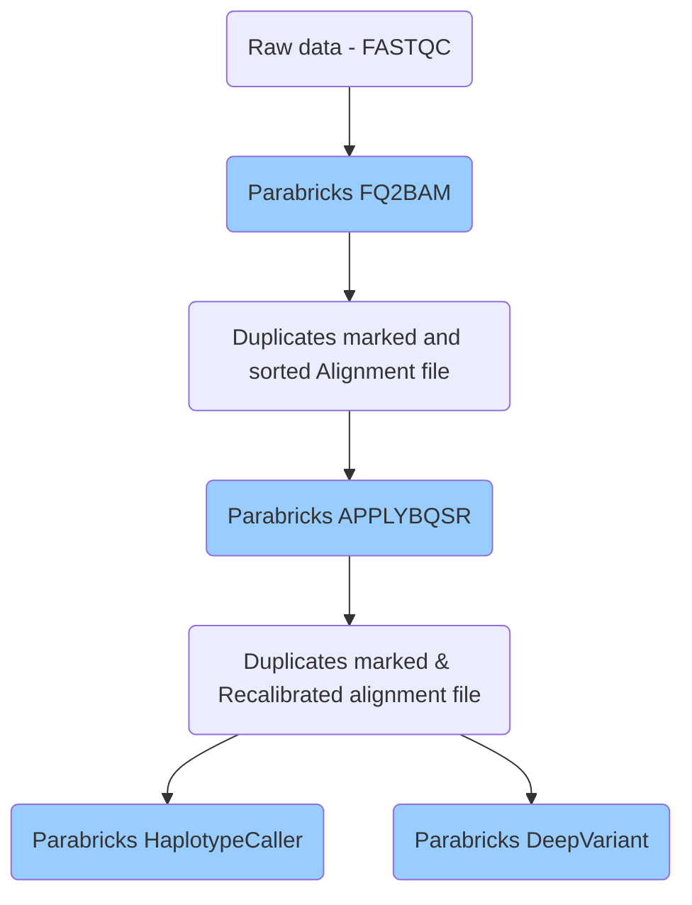
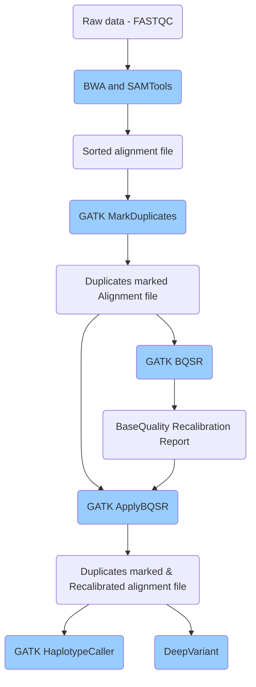

# `NAIC Accelerated Genomics` Germline variant calling pipeline

Useres can implement GPU-based and CPU-based germline variant calling pipelines using `NAIC Accelerated Genomics` workflow suite.

## GPU-based Germline variant calling pipeline

### Parabricks versions

* All available versions: https://catalog.ngc.nvidia.com/orgs/nvidia/teams/clara/containers/clara-parabricks/tags
* Version used in the pipeline (current Parabricks version used): `nvcr.io/nvidia/clara/clara-parabricks:4.1.2-1`

***More information: [Parabricks page](Parabricks.md)***

## CPU-based Germline variant calling pipeline

### CPU-based pipeline versions

* BWA: 0.7.17
* SAMTools: 1.18
* GATK: 4.3.0.0
* DeepVariant: 1.5.0
