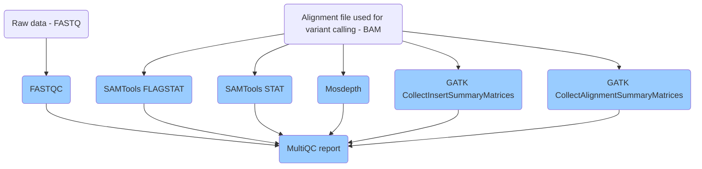

# Qualituy control (QC) steps

`NAIC Accelerated Genomics` implements QC steps on raw reads (FASTQ) used as input and alignment files generated in intermediate steps of the [Germline pipeline](Germline_pipeline.md). These QC processes are run on CPU platforms.

## QC pipeline workflow

## Processes in QC pipeline

* `FASTQC` - https://www.bioinformatics.babraham.ac.uk/projects/fastqc/
* `SAMtools flagstat` - https://www.htslib.org/doc/samtools-flagstat.html
* `SAMtools stat` - https://www.htslib.org/doc/samtools-stats.html
* `Mosdepth` - https://github.com/brentp/mosdepth
* `GATK CollectInsertSizeMetrics` - https://gatk.broadinstitute.org/hc/en-us
* `GATK collectAlignmentSummaryMetrics` - https://gatk.broadinstitute.org/hc/en-us
* `MultiQC` - https://multiqc.info/

## Versions in QC pipeline

* Mosdepth: 0.3.3--h37c5b7d_2
* FASTQC: 0.12.1
* SAMTools: 1.18
* GATK: 4.3.0.0
* MultiQC: 1.19
