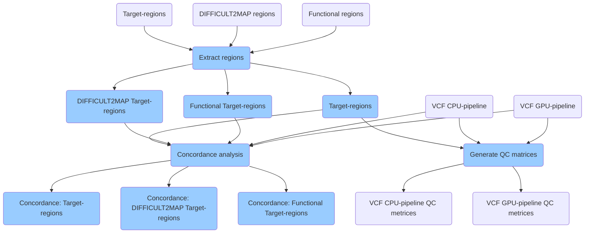

# Variant evaluation

Variant evaluation pipeline accepts VCF files from both CPU- and GPU-based pipelines and generates quality control matrices for each VCF file. Also, the pipeline performs concordance analysis on the two VCF files. The pipeline is designed to perform concordance analysis focusing on different target-regions. For example, in addition to the target-region file used for the exome capture kit, the pipeline accepts difficult-to-map and functional region files made available by PrecisionFDA [Truth Challenge](https://precision.fda.gov/challenges/truth/results).

## Tools used in variant evaluation

* BEDTools
* GATK Concordance
* GATK VAREVAL

## Versions
