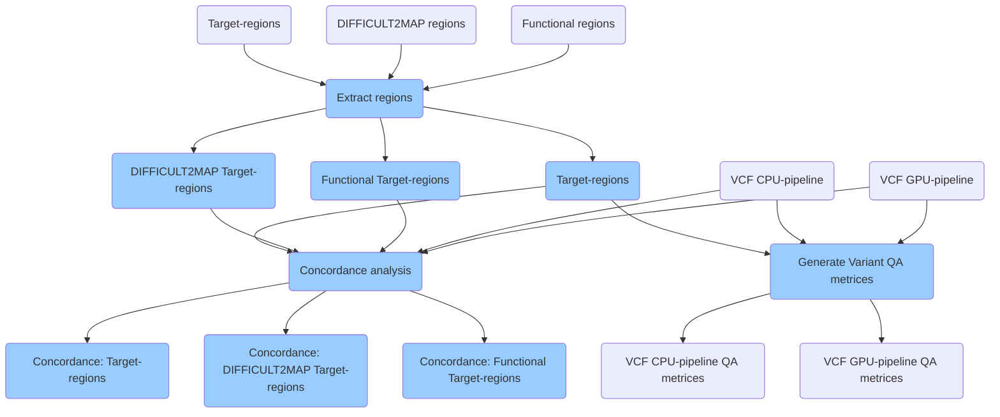

# Variant evaluation

The Variant Evaluation Pipeline is designed to critically assess the variants called from sequencing data. This process involves analyzing VCF (Variant Call Format) files generated by CPU- and GPU-based genomic pipelines. The evaluation pipeline serves to assess variant calling by providing quality control metrics and conducting concordance analysis between different sources of variant data.

## Features of the Variant Evaluation Pipeline

* Variant Quality Assessment (Variant QA):
  * For each input VCF file, the pipeline computes comprehensive quality control matrices that facilitate the scrutiny of the variant calling process.
* Concordance Analysis:
  * The pipeline performs concordance analysis between the VCF files from CPU- and GPU-based pipelines. This analysis aids in comparing the consistency and accuracy of variant calls from different computational approaches.
* Target-Region Focus:
  * Conduct analyses with a focus on specific genomic regions. The pipeline can be tailored to evaluate concordance in various regions, including:
  * The target regions outlined by the exome capture kit.
  * Regions that are challenging/difficult to map, which may impact call reliability.
  * Regions tagged as functional, potentially influencing phenotype.
  * Difficult to map and functional region definitions can be accessed via PrecisionFDA [Truth Challenge](https://precision.fda.gov/challenges/truth/results).

## Tools used in variant evaluation

* BEDTools
* GATK Concordance
* GATK VAREVAL

## Versions
